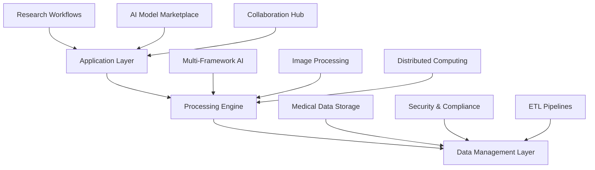
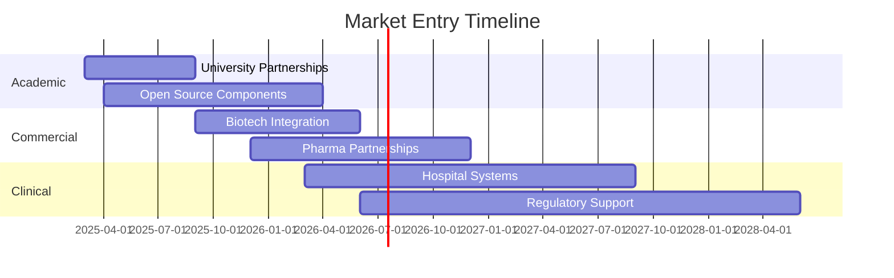

# Medical Research AI Tools: Market Analysis and Development Strategy

The medical imaging AI market is experiencing explosive growth, projected to reach $45 billion by 2026. However, significant gaps remain in current tools, particularly around unified multi-modal processing, collaborative workflows, and intuitive AI integration. This analysis examines the competitive landscape and outlines a strategy for building the next-generation medical research platform.


## Current Market Landscape

### Key Market Drivers
- **Precision medicine demand** requiring detailed cellular analysis
- **Growing imaging data volumes** exceeding human processing capabilities  
- **AI model maturation** enabling clinical-grade accuracy
- **Regulatory acceptance** with increasing FDA approvals
- **Cost pressures** driving research automation

## Comprehensive Competitive Analysis

### Open Source Solutions Comparison

| Tool | Primary Focus | Key Strengths | Critical Limitations | GitHub Stars |
|------|---------------|---------------|---------------------|--------------|
| **CellProfiler** | Cell image analysis | Modular pipelines, academic validation | No WSI support, desktop-only |  |
| **ImageJ** | General microscopy | Massive plugin ecosystem, 3D processing | Outdated UI, performance issues |  |
| **QuPath** | Digital pathology | Native WSI processing, deep learning | Java expertise required, narrow focus |  |
| **Ilastik** | Interactive ML | No-code segmentation, user-friendly | Limited scalability, training overhead |  |
| **Orbit** | WSI preprocessing | Large image handling, ML classification | Manual model training, Java-based |  |

### Commercial Solutions Analysis

| Platform | Market Position | Pricing Model | Key Differentiators | Target Users |
|----------|-----------------|---------------|-------------------|--------------|
| **HALO** | Enterprise leader | $50K-200K/year | Advanced AI, regulatory compliance | Large institutions |
| **Aiforia** | Cloud-first | $5K-50K/year | Zero infrastructure, collaborative | Mid-size labs |


## Technical Architecture Deep Dive

### Current Tool Technology Stacks

**CellProfiler Architecture:**
```python
# Core dependencies and capabilities
numpy + scipy          # Numerical computing
pandas                 # Data analysis  
scikit-image + opencv  # Image processing
tensorflow/keras       # Deep learning (recent)
wxpython              # Desktop GUI
matplotlib            # Visualization
bio-formats           # Microscopy formats
```

**Key Technical Limitations:**
- **WSI Processing Gap**: Most tools require external preprocessing for Whole Slide Images
- **Scalability Issues**: Desktop-centric architecture limits distributed processing
- **AI Integration**: Bolt-on approach rather than native AI-first design
- **Collaboration Barriers**: Single-user tools in multi-team research environment

## Market Gap Analysis

### Critical Unmet Needs

| Gap Category | Current State | Market Impact | Opportunity Size |
|--------------|---------------|---------------|------------------|
| **Multi-modal Processing** | Separate tools for each modality | High friction, data silos | $2.5B addressable market |
| **Collaborative Workflows** | Individual desktop applications | Reduced research velocity | $1.8B potential |
| **AI-Native Design** | Retrofitted AI capabilities | Limited automation potential | $3.2B opportunity |
| **Intuitive UX** | Technical expert-focused | Barriers for domain scientists | $1.5B market |


## Strategic Development Framework

### Three-Layer Platform Architecture



#### Layer 1: Application Layer
**Focus**: Translating complex workflows into intuitive experiences

**Core Components:**
- **Pipeline Builder**: Drag-and-drop workflow creation
- **AI Model Marketplace**: Pre-trained and custom model deployment
- **Collaboration Hub**: Real-time project sharing and commenting
- **Results Dashboard**: Interactive analysis visualization

#### Layer 2: Processing Engine
**Focus**: High-performance computational backbone

**Technical Stack:**
```python
# Modern Python ecosystem
import torch              # Deep learning framework
import fastapi           # High-performance APIs
import dask              # Distributed computing
import zarr              # Scalable array storage
import opencv_contrib_python as cv2  # Computer vision
```

**Key Capabilities:**
- **Multi-framework AI**: PyTorch, TensorFlow, ONNX support
- **WSI Optimization**: Efficient gigapixel image processing
- **Cloud-native**: Kubernetes orchestration and auto-scaling
- **Edge Computing**: Local processing for sensitive data

#### Layer 3: Data Management
**Focus**: Scalable, secure medical data handling

**Architecture Components:**
- **Object Storage**: MinIO/S3 for imaging data
- **Metadata Database**: PostgreSQL with medical schemas
- **Security**: HIPAA/GDPR compliance, audit logging
- **ETL Framework**: Apache Airflow for complex workflows

### Cross-Platform Development Strategy

| Platform | Technology | Key Features | Target Users |
|----------|------------|--------------|--------------|
| **Web** | React + TypeScript | Universal access, real-time collaboration | All researchers |
| **Desktop** | Tauri (Rust + Web) | High-performance local processing | Power users |
| **Mobile** | React Native | Remote monitoring, basic analysis | Field researchers |


## Development Roadmap

### Phase 1: Foundation (Months 1-6)
| Milestone | Technical Focus | Business Validation |
|-----------|----------------|-------------------|
| **Core Architecture** | Microservices, API design | 50+ researcher interviews |
| **Basic Processing** | Fundamental image analysis | 5 partner lab prototypes |
| **User Management** | Authentication, access control | Market validation surveys |

### Phase 2: Core Features (Months 7-12)
| Milestone | Technical Focus | Market Expansion |
|-----------|----------------|------------------|
| **AI Integration** | Model serving, training UI | University partnerships |
| **Collaboration** | Real-time sharing, comments | Academic pricing launch |
| **Mobile Apps** | iOS/Android companions | Beta user program |

### Phase 3: Advanced Capabilities (Months 13-18)
| Milestone | Technical Focus | Commercial Growth |
|-----------|----------------|-------------------|
| **Enterprise Features** | Multi-tenant, compliance | Pharma partnerships |
| **Federated Learning** | Collaborative model training | CRO integrations |
| **Model Marketplace** | Community model sharing | Revenue diversification |

### Phase 4: Market Leadership (Months 19-24)
| Milestone | Technical Focus | Global Expansion |
|-----------|----------------|------------------|
| **Clinical Integration** | EHR connections, regulatory | Hospital system pilots |
| **Advanced Analytics** | Predictive modeling, insights | International markets |
| **AI Innovation** | LLM integration, automated analysis | Industry thought leadership |

## Competitive Differentiation Strategy

### Unique Value Propositions

| Differentiator | Our Approach | Competitive Advantage |
|----------------|--------------|---------------------|
| **Universal Compatibility** | All imaging modalities in one platform | Eliminates tool switching overhead |
| **AI-First Design** | Native AI capabilities from ground up | Superior automation and insights |
| **Collaborative Platform** | Real-time multi-user workflows | Faster research collaboration |
| **No-Code AI** | Visual model training and deployment | Democratizes AI for domain experts |
| **Regulatory Ready** | Built-in compliance and audit trails | Reduces clinical research barriers |


## Market Entry and Revenue Strategy

### Go-to-Market Phases



### Revenue Model

| Tier | Target Users | Monthly Price | Key Features |
|------|-------------|---------------|--------------|
| **Academic** | Students, basic research | Free | Basic analysis, community support |
| **Professional** | Individual researchers | $99/month | Advanced AI, collaboration tools |
| **Enterprise** | Institutional deployment | $999/month | Multi-tenant, compliance, support |
| **Clinical** | Hospital systems, pharma | Custom pricing | Regulatory features, integration |

## Risk Assessment and Success Metrics

### Key Risks and Mitigation

| Risk Category | Specific Risk | Probability | Impact | Mitigation Strategy |
|---------------|---------------|-------------|---------|-------------------|
| **Technical** | Scalability issues | Medium | High | Cloud-native architecture, load testing |
| **Market** | Slow AI adoption | Low | Medium | Conservative projections, multiple segments |
| **Competitive** | Feature matching by incumbents | High | Medium | Patent protection, innovation velocity |
| **Regulatory** | Compliance changes | Medium | High | Legal expertise, compliance-first development |

### Success Metrics Dashboard

| Category | Metric | Target Year 1 | Target Year 2 |
|----------|--------|---------------|---------------|
| **Growth** | Monthly Active Users | 1,000 | 10,000 |
| **Revenue** | Annual Recurring Revenue | $500K | $5M |
| **Technical** | Platform Uptime | 99.5% | 99.9% |
| **Impact** | Published Papers Using Platform | 50 | 500 |


## Technology Innovation Opportunities

### Emerging Capabilities Integration

**Large Language Models for Research:**
- Natural language querying of datasets
- Automated research report generation
- Literature correlation and insights
- Experimental protocol optimization

**Advanced Computer Vision:**
- Multi-modal imaging fusion
- Real-time analysis during acquisition
- 3D tissue reconstruction from 2D sections
- Super-resolution enhancement

**Edge AI Deployment:**
- Local processing for data privacy
- Offline capabilities for remote research
- Real-time feedback during imaging
- Reduced cloud dependency and costs

## Conclusion and Next Steps

The medical research AI landscape presents a significant opportunity to build a unified platform that addresses current market fragmentation and usability barriers. Key success factors include:

1. **Technical Excellence**: Modern, scalable architecture with native AI capabilities
2. **User-Centric Design**: Intuitive interfaces that democratize advanced analysis
3. **Strategic Partnerships**: Strong relationships with academic and commercial research institutions
4. **Regulatory Preparedness**: Compliance-first approach enabling clinical applications

### Immediate Action Items

**Technical Development:**
- [ ] Finalize architecture specifications and technology stack
- [ ] Establish development team with medical imaging and AI expertise
- [ ] Set up cloud infrastructure and development environments
- [ ] Begin core image processing engine development

**Market Validation:**
- [ ] Conduct detailed interviews with 20+ potential users across segments
- [ ] Establish partnerships with 3-5 research institutions for beta testing
- [ ] Analyze competitor feature sets and pricing models in detail
- [ ] Develop minimum viable product (MVP) specification

**Business Foundation:**
- [ ] Secure initial funding for 18-month development runway
- [ ] Establish legal entity and intellectual property strategy
- [ ] Build advisory board with medical research and AI industry experts
- [ ] Develop go-to-market strategy and initial customer acquisition plan

The convergence of advancing AI capabilities, growing research data volumes, and increasing demand for collaborative tools creates an ideal market opportunity. With careful execution of this strategic framework, we can build the platform that defines the next generation of medical research technology.

---

*This analysis provides the foundation for developing a comprehensive medical research AI platform. The proposed approach addresses current market gaps while positioning for future technology trends and research needs.*